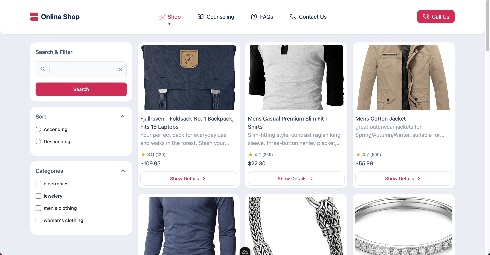

# Nuxt 3 Online Shop

This repository contains a simple SSR online shop built using Nuxt 3.

## Screenshots



## Technologies Used

- Nuxt 3
- Server-side Rendering
- Tailwind css
- Repository design pattern for API Management

  
## Features

- Responsive design
- Listing Shop Items
- Filter & Search Shop Items
- Show Shop Items

## Installation

1. Clone the repository:

   ```bash
   git clone https://github.com/iamhosen/online-shop-nuxt.git

2. Navigate to the project directory:
   
   ```bash
   cd online-shop-nuxt

3. Install dependencies

    ```bash
    npm install


4. Start the development server
   
    ```bash
    npm run dev

5. Open your browser and visit http://localhost:3000/ to view the app.


## Credits

This Restaurant App is developed by Hossein Amirhosseini.

## License

This project is licensed under the [MIT License](LICENSE).
